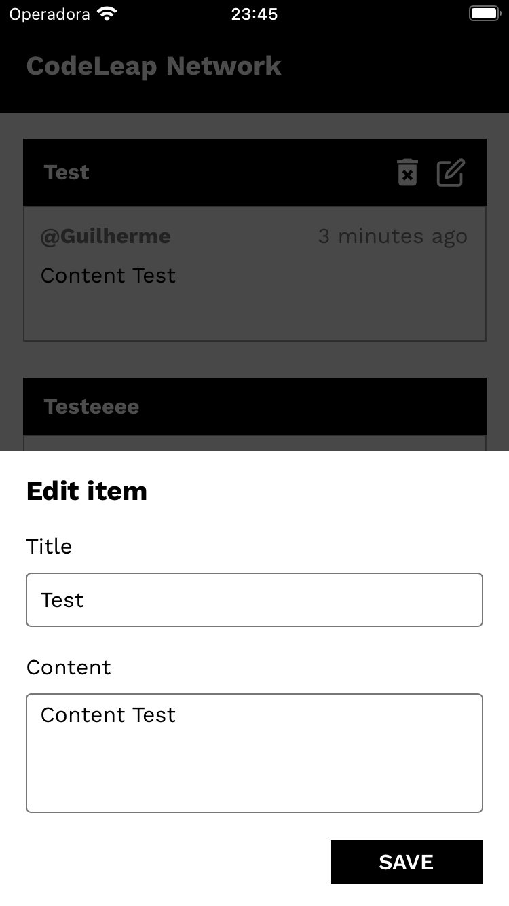

# CodeLeap Engineering Test

https://user-images.githubusercontent.com/59057060/187120617-c6809cc8-fad4-4f50-9439-d745b42521d9.mp4

### Setup Environment

Project created with Expo.[ See official docs](https://docs.expo.dev/) to set up the environment.

### Run

**Install dependencies**

```
yarn
```

**Starting project**

```
yarn start
```

**Run IOS**

```
i
```

**Run Android**

```
a
```

### Tech and Libraries

- React Native
- Expo
- TypeScript
- React Navigation
- Async Storage
- Redux
- Redux Toolkit
- Redux Persist
- Date-fns
- Formik
- Yup
- React Native Modal
- React Native Responsive Font Size
- Styled Components


### App Screenshots

|               |                             Android                             |                             IOS                             |
| :-----------: | :-------------------------------------------------------------: | :---------------------------------------------------------: |
| Splash Screen |  |  |
|    Sign Up    |        |        |
|  List Posts   |     |     |
|  Create Post  |    |    |
|   Edit Post   |      |      |
|  Delete Post  |    |    |
